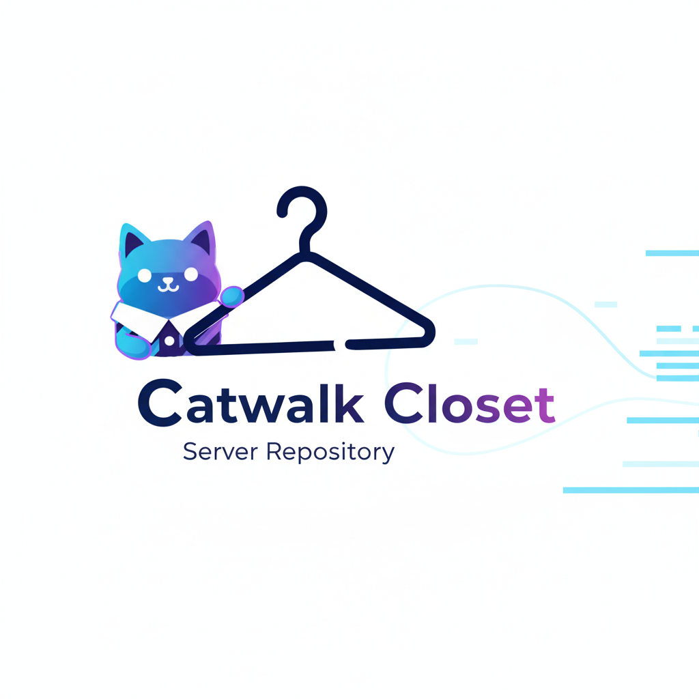

****

****
**El motor detrás de tu aplicación de moda y organización. Estilo y funcionalidad se encuentran en este backend.**

---

## 💡 Sobre el Proyecto

**Catwalk Closet** es una aplicación móvil diseñada para revolucionar la gestión del guardarropa. Permite a los usuarios digitalizar sus prendas, crear y guardar *outfits*, y planificar su vestuario semanal.

Este repositorio alberga el **código fuente del servidor (*backend*)** que soporta todas las funcionalidades de la aplicación móvil.

---

## ⚙️ Arquitectura del Servidor

El servidor está construido como una **API RESTful** robusta, diseñada para ofrecer una comunicación rápida y segura con la aplicación móvil.

### 🛠️ Tecnologías Clave

| Componente | Descripción |
| :--- | :--- |
| **Backend Framework** | [Inserta tu Framework aquí, ej: **Node.js con Express**, Django, Spring Boot] |
| **Base de Datos** | [Inserta tu DB aquí, ej: **PostgreSQL**, MongoDB, MySQL] |
| **Lenguaje** | [Inserta el lenguaje principal, ej: **JavaScript**, Python, Java] |
| **Almacenamiento de Archivos** | [Inserta el servicio para guardar imágenes, ej: **AWS S3**, Google Cloud Storage, Local] |
| **Contenedores** | [Si aplica, ej: **Docker** y **Kubernetes**] |

### 🚀 Despliegue (Deployment)

El servidor se despliega en [Inserta tu servicio de *hosting*, ej: **Google Cloud Platform (GCP)** / AWS EC2] y sigue una arquitectura [Inserta tu patrón, ej: Microservicios / Monolítica].

---

## 📈 Estado y Desempeño del Servidor

Esta sección te permite incrustar **insignias (*badges*)** y gráficos que monitorean el estado de tu servidor en tiempo real.

**(Nota:** Para que estos gráficos funcionen, debes usar servicios de monitoreo como **Uptime Robot**, **Shields.io**, o **Prometheus/Grafana** e incrustar sus URLs de imágenes. Aquí hay ejemplos de cómo se verían en el `README.md`.)**

### 🟢 Estado del Servicio

| Servicio | Estado |
| :--- | :--- |
| **API Principal** |  |
| **Base de Datos** |  |
| **Pruebas Unitarias** |  |
| **Cobertura de Código** |  |

### 📊 Gráficos de Desempeño

Puedes incrustar gráficos de herramientas como **Grafana** o **Datadog** que muestren métricas clave del *backend*:

* **Latencia Media de la API:** Gráfico que muestra el tiempo de respuesta promedio de los *endpoints*.
    > [Inserta aquí la URL de la imagen del gráfico de Latencia (ej: generada por Grafana)]
* **Uso de Recursos del Servidor (CPU/RAM):** Gráfico de la carga del servidor en las últimas 24 horas.
    > [Inserta aquí la URL de la imagen del gráfico de Uso de CPU/RAM]

---

## 🤝 Contribuciones

¡Tu ayuda es bienvenida! Si deseas contribuir a mejorar la escalabilidad, el rendimiento o la seguridad de nuestro *backend*, por favor sigue estos pasos:

1.  **Clona el Repositorio:** `git clone https://docs.github.com/en/repositories/creating-and-managing-repositories/deleting-a-repository`
2.  **Crea una Rama:** `git checkout -b feature/nueva-funcionalidad`
3.  **Realiza Cambios:** Sigue las directrices de estilo de código.
4.  **Abre un Pull Request (PR):** Asegúrate de que todas las pruebas pasen.

### 📝 Directrices de Código

* [Detalla tu estándar de *commit* o linters aquí.]
* [Añade un enlace a tu archivo CONTRIBUTING.md si existe.]

---

## 🔑 Endpoints Clave de la API

| Ruta | Método | Descripción | Requiere Auth |
| :--- | :--- | :--- | :--- |
| `/api/v1/auth/login` | `POST` | Autentica al usuario y devuelve un token. | ❌ |
| `/api/v1/items` | `GET` | Obtiene todas las prendas del usuario. | ✅ |
| `/api/v1/outfits` | `POST` | Crea un nuevo *outfit* combinando prendas. | ✅ |
| `/api/v1/planner` | `GET` | Obtiene el calendario de *outfits* planificados. | ✅ |

---

## 📄 Licencia

Este proyecto está bajo la Licencia [Inserta tu Licencia, ej: **MIT**]. Consulta el archivo `LICENSE` para más detalles.
